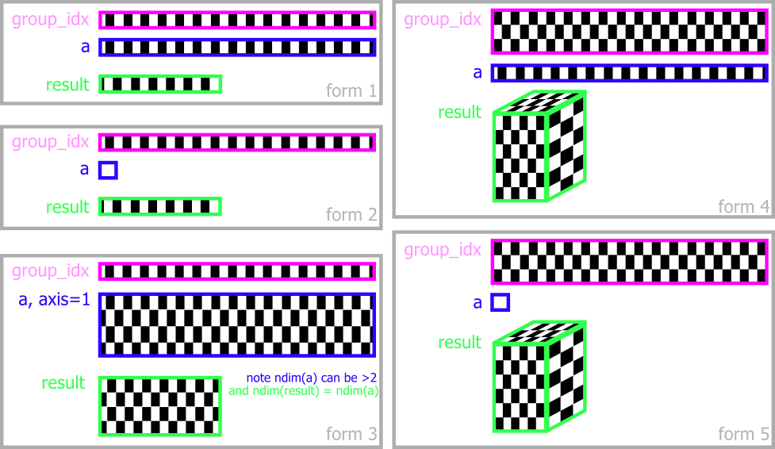

# aggregate: reference

Full reference for `numpy_groupies.aggregate`. For an introduction see the [README](../README.md).

**Contents:**
[Signature and parameters](#signature-and-parameters) ·
[Input forms in detail](#input-forms-in-detail) ·
[Available functions](#available-functions) ·
[Function × implementation matrix](#function--implementation-matrix) ·
[Fill values](#fill-values) ·
[Complex values](#complex-values) ·
[More examples](#more-examples)

## Signature and parameters

```python
aggregate(group_idx, a, func="sum", size=None, fill_value=DEFAULT_FILL_VALUE,
          order="C", dtype=None, axis=None, ddof=0, dx=1.0, reverse=False)
```

| Parameter    | Description |
| ------------ | ----------- |
| `group_idx`  | Array of non-negative integers used as labels to group the values in `a`. Normally 1-D with the same length as `a`. It may also be 2-D (or nested sequences convertible to 2-D): then the size of the 0th dimension is the number of output dimensions, and `group_idx[i, j]` is the index into the *i*-th output dimension for `a[j]`. |
| `a`          | Array of values to aggregate. Normally 1-D; can be a scalar in some cases (see [forms](#input-forms-in-detail)). |
| `func`       | Aggregation function. Default `'sum'`. A name from [Available functions](#available-functions), an alias, a NumPy function or builtin (`np.max`, `max`, `len`, …), or any callable. The aliases are defined in `utils.py`. |
| `size`       | Shape of the output. `None` means: the maximum of `group_idx` (plus one) determines the size. For multi-dimensional output, give the size of every dimension (or `None`). |
| `fill_value` | Value for output groups that never occur in `group_idx`. By default chosen per function, see [Fill values](#fill-values). The sentinel `DEFAULT_FILL_VALUE` stands for "use that default". |
| `order`      | `'C'` (default) or `'F'`. Memory layout of multi-dimensional output. Hardly affects the speed of `aggregate`, but may matter for your downstream use of the result. |
| `dtype`      | Output dtype. `None` chooses something sensible from `a`, `func` and `fill_value`. Non-numeric output of custom functions needs `dtype=object`. |
| `axis`       | Aggregate along one axis of a multi-dimensional `a`. See form 3 below. Not supported by the pure-Python implementation. |
| `ddof`       | Delta degrees of freedom for `var` and `std`; the divisor is `N - ddof`. Default 0. |
| `dx`         | Sample spacing for `trapezoid`. Default 1.0. |
| `reverse`    | Only for `sort`: sort descending instead of ascending. |

Exceptions are raised in most cases where `fill_value` and `dtype` are incompatible, rather than silently coercing.

## Input forms in detail



1. **1-D / 1-D.** `group_idx` and `a` are 1-D of equal length. Output is 1-D.
2. **1-D / scalar.** `a` is broadcast to the length of `group_idx`. Mostly used for counting: `aggregate(group_idx, 1)`.
3. **1-D (or broadcastable) / N-D with `axis`.** `group_idx` has the length `a.shape[axis]`; alternatively it has the same number of dimensions as `a` with a shape broadcastable to `a.shape` (e.g. to use separate labels for every row). The groups are broadcast along the other axes of `a`, and the result has the groups in place of `axis`:

   ```python
   a = np.zeros((3, 5))
   aggregate(np.array([3, 3, 7, 0, 0]), a, axis=1).shape    # (3, 8)
   aggregate(np.array([3, 3, 7, 0, 0]), a.T, axis=0).shape  # (8, 3)
   ```

4. **2-D / 1-D.** `a` is 1-D, `group_idx` is 2-D with shape `(d, n)` and `n == len(a)`. The output has `d` dimensions; `group_idx[:, 99]` gives the `(x, y, z)` position of `a[99]`.
5. **2-D / scalar.** Form 4 with a scalar `a`. Mostly used for N-D histograms.

**Performance and memory layout.** In form 4, columns of `group_idx` should be contiguous in memory (`group_idx[:, 99]` should be one contiguous chunk). In form 3 all the data in `a` that belongs to one `group_idx[i]` should be contiguous — for `axis=1` that means `a[:, 55]` should be contiguous.

## Available functions

Not every implementation provides every function; see the [matrix](#function--implementation-matrix) below.

### Reductions

One value per group.

| Function       | Result |
| -------------- | ------ |
| `sum`          | Sum of the items. (aliases: `add`, `plus`) |
| `prod`         | Product. (aliases: `product`, `multiply`, `times`) |
| `len`          | Number of items. (alias: `count`) Equivalent to `np.bincount(group_idx)` — which is how the NumPy implementation computes it. |
| `sumofsquares` | Sum of squares. |
| `mean`         | Mean. |
| `median`       | Median. |
| `var`          | Variance; the divisor is `N - ddof` (`ddof=0` by default). |
| `std`          | Standard deviation; `ddof` as for `var`. |
| `min`, `max`   | Minimum / maximum. (aliases: `amin`, `minimum`; `amax`, `maximum`) |
| `first`, `last` | First / last item of the group, in the order of appearance in `a`. |
| `argmin`, `argmax` | Index *in `a`* of the minimum / maximum of each group. |
| `trapezoid`    | Trapezoidal integral of the items, taken in the order they appear in `a`. `dx` sets the sample spacing. A group of fewer than two items integrates to 0. The callable `np.trapezoid` can be passed as `func` too. |

### NaN-skipping variants

Prefix with `nan` — `nansum`, `nanprod`, `nanlen`, `nansumofsquares`, `nanmean`, `nanmedian`, `nanvar`, `nanstd`, `nanmin`, `nanmax`, `nanfirst`, `nanlast`, `nanargmin`, `nanargmax`, `nantrapezoid`, `nanall`, `nanany`, and the cumulative `nancumsum`, `nancumprod`, `nancummin`, `nancummax` — to skip NaNs instead of propagating them. `nanlen` counts the non-NaN items. For `nantrapezoid` this means integrating over the remaining items, bridging the gap a NaN leaves.

**Pandas implementation.** pandas skips NaN by default, so the `nan…` variants there are simply the plain function: `sum`, `prod`, `mean`, `var`, `std`, `min`, `max`, `first`, `last`, `argmin` and `argmax` give the same result as their `nan` forms (they skip NaN, unlike the NumPy and Numba implementations). `len` counts only the non-NaN items, i.e. it behaves like `nanlen`. Two plain functions are deliberately patched to propagate NaN like NumPy does: `median` and `cumsum`. For `all`/`any` the plain and `nan` forms differ for groups consisting only of NaN, so use `nanall`/`nanany` if you want NumPy-consistent results. The values listed in the other sections describe the NumPy and Numba implementations.

### Boolean

Always return booleans. Their treatment of NaN differs from the above.

| Function | Result |
| -------- | ------ |
| `all`    | `True` if all items are truthy. Note that `np.all(nan)` is `True`: NaN is truthy. (alias: `and`) |
| `any`    | `True` if any item is truthy. (alias: `or`) |
| `allnan` | `True` if all items are NaN. |
| `anynan` | `True` if any item is NaN. |

### Cumulative and sorting

These do not reduce the data; the output has the size of the input. There are no empty groups in the output, so `fill_value` has no effect on them.

| Function | Result |
| -------- | ------ |
| `cumsum`, `cumprod`, `cummin`, `cummax` | Cumulative sum / product / minimum / maximum within each group, in order of appearance. |
| `sort`   | Sorts the items within each group, ascending; `reverse=True` for descending. The output is the input-sized array with each group's items sorted among the positions the group occupies. (aliases: `sorted`, `asort`, `asorted`, `dsort`, `rsorted` — note that despite the names, the last two do *not* reverse; use `reverse=True`) |

### Collecting

| Function | Result |
| -------- | ------ |
| `array`  | The grouped items themselves, in the order they appear in `a` — one sequence per group. (aliases: `split`, `splice`) |

## Function × implementation matrix

`x` = supported, `-` = raises `NotImplementedError` (checked against v0.12.3 by calling each implementation).
The nan-variants are supported wherever the plain function is (see the pandas note under [NaN-skipping variants](#nan-skipping-variants) for how NaN is treated there).

| Function                       | numpy | numba | pure python | ufunc | pandas |
| ------------------------------ | :---: | :---: | :---------: | :---: | :----: |
| `sum`, `prod`, `len`           |  x    |  x    |      x      |  x    |   x    |
| `min`, `max`                   |  x    |  x    |      x      |  x    |   x    |
| `all`, `any`                   |  x    |  x    |      x      |  x    |   x    |
| `allnan`, `anynan`             |  x    |  x    |      x      |  x    |   x    |
| `mean`, `median`, `var`, `std` |  x    |  x    |      x      |  -    |   x    |
| `first`, `last`                |  x    |  x    |      x      |  -    |   x    |
| `argmin`, `argmax`             |  x    |  x    |      x      |  -    |   x    |
| `sumofsquares`                 |  x    |  x    |      -      |  -    |   -    |
| `trapezoid`                    |  x    |  x    |      x      |  -    |   -    |
| `cumsum`                       |  x    |  x    |      -      |  -    |   x    |
| `cumprod`, `cummin`, `cummax`  |  -    |  x    |      -      |  -    |   x    |
| `sort`, `array`                |  x    |  -    |      x      |  -    |   -    |
| `nan…` variants of the above   |  x¹   |  x¹   |     x¹      |  -    |   x¹   |
| custom callables               |  x    |  x²   |      x      |  -    |   x    |

¹ For the same functions as in the plain row.
² Numba jit-compiles custom functions, so they must consist of numeric, Numba-compatible code, and the speed-up is modest. Anything else — for instance building strings with `dtype=object` — fails; use `aggregate_np` instead.

Which implementation you get by default is explained in the [README](../README.md#implementations). When numba is installed, call `aggregate_np` or `aggregate_py` for the functions numba lacks.

## Fill values

Groups without any item are filled with `fill_value`. By default this matches what the corresponding NumPy function returns for empty input:

| Functions                                              | Default fill value |
| ------------------------------------------------------ | ------------------ |
| `sum`, `len`, `sumofsquares` (and `nan`-forms)         | `0`                |
| `prod` (and `nanprod`)                                 | `1`                |
| `all`, `any`, `allnan`, `anynan`                       | `False`            |
| `mean`, `median`, `var`, `std` (and `nan`-forms)       | `nan`              |
| `min`, `max`, `first`, `last` (and `nan`-forms)        | `nan` for floating input, `0` where the output is an integer type, which cannot hold `nan` |
| `argmax`, `argmin` (and `nan`-forms)                   | `-1`               |
| `trapezoid`, `nantrapezoid`                            | `0`, as for a single sample |
| `array`, `sort`                                        | an empty sequence  |
| a custom `func`                                        | `nan` for floating input, `0` otherwise |

The cumulative functions and `sort` return one value per input item, so no group is ever empty in their output and `fill_value` has no effect.

Query a default without repeating this table:

```python
npg.default_fill_value("prod")           # 1
npg.default_fill_value("min", int)       # 0
npg.default_fill_value("argmin")         # -1
```

## Complex values

Complex input is supported wherever the result is well defined, following NumPy's conventions.

- **Keep the complex dtype:** `sum`, `prod`, `mean`, `median`, `trapezoid`, `sort`, `first`, `last`, `array` and the `cumsum` functions. `median` and `sort` use NumPy's lexicographic ordering (real part first, then imaginary part).
- **Return a real dtype:** `var`, `std` and `sumofsquares` measure squared magnitudes, like `np.var` on complex input.
- **Order statistics** `min`, `max`, `argmin`, `argmax` and their `nan` counterparts follow the same lexicographic ordering everywhere — the real part decides, the imaginary part only breaks ties — including the Numba implementation, which compares the two parts itself since neither Python nor Numba orders complex numbers. As in NumPy, a value with a NaN in either part compares neither smaller nor greater.

## More examples

Sums and products of consecutive integers:

```python
group_idx = np.arange(5).repeat(3)
# array([0, 0, 0, 1, 1, 1, 2, 2, 2, 3, 3, 3, 4, 4, 4])
a = np.arange(group_idx.size)
npg.aggregate(group_idx, a)             # array([ 3, 12, 21, 30, 39])      (sum is the default)
npg.aggregate(group_idx, a, "prod")     # array([   0,   60,  336,  990, 2184])
```

Trapezoidal integration, with a sample spacing:

```python
npg.aggregate(group_idx, a, func="trapezoid")                   # array([ 2.,  8., 14., 20., 26.])
npg.aggregate(group_idx, a, func="trapezoid", dx=0.5)           # array([ 1.,  4.,  7., 10., 13.])
```

Cumulative sum — same length as input:

```python
group_idx = np.array([4, 3, 3, 4, 4, 1, 1, 1, 7, 8, 7, 4, 3, 3, 1, 1])
a         = np.array([3, 4, 1, 3, 9, 9, 6, 7, 7, 0, 8, 2, 1, 8, 9, 8])
npg.aggregate(group_idx, a, func="cumsum")
# array([ 3,  4,  5,  6, 15,  9, 15, 22,  7,  0, 15, 17,  6, 14, 31, 39])
```

Custom function producing strings (NumPy implementation; Numba cannot compile this):

```python
group_idx = np.array([1, 0, 1, 4, 1])
a = np.array([12.0, 3.2, -15, 88, 12.9])
npg.aggregate_np(group_idx, a, func=lambda g: " or maybe ".join(str(gg) for gg in g),
                 fill_value="", dtype=object)
# ['3.2', '12.0 or maybe -15.0 or maybe 12.9', '', '', '88.0']
```
